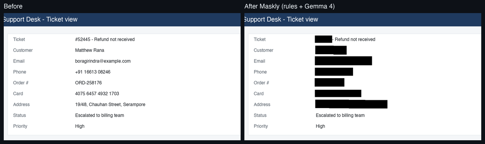
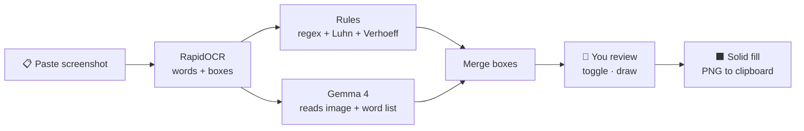
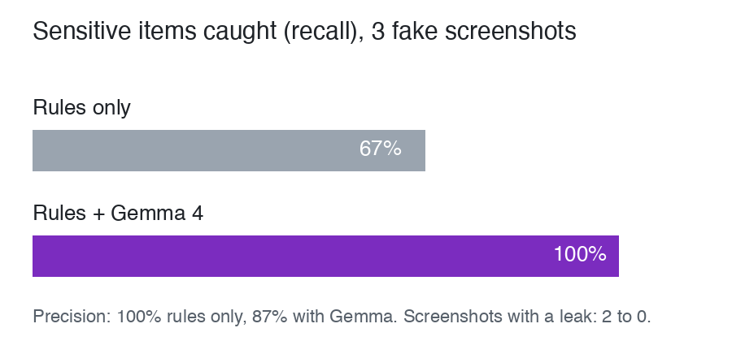

<div align="center">

# 🕶️ Maskly

**Redact before you send.**
Paste a customer screenshot and get a safe copy back in a few seconds. Emails, card numbers, names, addresses and API keys get blacked out by a Gemma 4 model running on your own laptop.


**[▶ Try the live demo](https://omkarkirpan.github.io/maskly/)** · saved results from a real run (scanning your own images needs the local app)



</div>

---

## The problem

Support agents paste customer screenshots into tickets, Slack threads and vendor escalations many times a day. Those screenshots are full of personal data. Redacting by hand is slow and easy to get wrong, and cloud redaction tools send the same data to yet another server.

**Maskly does the redaction on your own machine.** You paste a screenshot, check the boxes, and copy the safe version.

## How it works

Three detectors find exact positions. Gemma only **chooses among words OCR already found**, so it can never put a box in the wrong place.



| Detector | What it catches | Why |
|---|---|---|
| **Rules** | Emails, phone numbers, card numbers (Luhn check), Aadhaar (Verhoeff check), PAN, IFSC, IPv4/IPv6, internal hostnames, AWS / GitHub / Slack / OpenAI keys, JWTs, private keys | Exact patterns. Fast. Always run. |
| **Gemma 4** | Names, postal addresses, order / customer / account IDs, bank account numbers | Needs context: a name in a "Customer" field, an ID next to "Order #". |
| **You** | Anything missed | One click turns a box off. Drag to draw a new one. |

Gemma returns strict JSON. Any word ID it makes up is thrown away:

```json
{"findings": [{"word_ids": [14, 15], "category": "person_name", "confidence": 0.86, "reason": "Name in Customer field"}]}
```

## Results



| | Items caught (recall) | Correct boxes (precision) | Screenshots with a leak |
|---|---|---|---|
| Rules only | 10 / 15 (67%) | 100% | 2 of 3 |
| **Rules + Gemma 4** | **15 / 15 (100%)** | 87% | **0 of 3** |

Measured on 3 synthetic screenshots (support ticket, KYC review, error log) made with fake [Faker](https://faker.readthedocs.io) data, with `gemma-4-26b-a4b-it`. It is a small test set, so treat it as a first signal. Reproduce it with `uv run python eval.py`.

## Safety by design

- **Fail closed.** If Gemma is missing, slow or fails, the rule boxes still apply. A **partial scan** banner appears, and Copy stays locked until you confirm you checked the image.
- **Solid fill, never blur.** Blurred text can be rebuilt. Maskly draws opaque boxes and re-encodes the PNG, so no original pixels or EXIF data remain.
- **In memory only.** The server reads the image from the request body. It writes no temp files and keeps no logs of content.
- **Human in the loop.** Every box is shown with its category and reason before anything is copied. Maskly assists. It does not guarantee.

## Quick start

You need [uv](https://docs.astral.sh/uv/) and [Ollama](https://ollama.com).

```bash
git clone https://github.com/OmkarKirpan/maskly && cd maskly
ollama pull gemma4:e2b          # 4.6 GB · use gemma4:e4b on a 16 GB machine
uv sync
uv run uvicorn app:app --port 8000
```

Open **http://localhost:8000** and paste a screenshot (<kbd>⌘V</kbd>).

| Key | Action |
|---|---|
| <kbd>⌘V</kbd> / drop / **Open…** | Load a screenshot |
| Click a box | Turn it off or on |
| Drag | Draw a new box |
| <kbd>P</kbd> | Preview the redacted result |
| <kbd>⌘</kbd> <kbd>↵</kbd> | Copy the redacted PNG |

## Configuration

Put settings in a `.env` file and start with `uv run --env-file .env uvicorn app:app --port 8000`.

| Variable | Default | Meaning |
|---|---|---|
| `MASKLY_MODEL` | `gemma4:e2b` | Local Ollama model |
| `MASKLY_OLLAMA` | `http://localhost:11434` | Ollama server |
| `MASKLY_TIMEOUT` | `30` | Seconds before a local call counts as failed |
| `MASKLY_THRESHOLD` | `0.6` | Minimum Gemma confidence for a box |
| `GEMINI_API_KEY` | — | Turns on the cloud fallback (optional) |
| `MASKLY_CLOUD_MODEL` | `gemma-4-26b-a4b-it` | Gemini API model for the fallback |
| `MASKLY_CLOUD_TIMEOUT` | `90` | Seconds before a cloud call counts as failed |

### Cloud fallback

Campus Wi-Fi and small laptops don't always cooperate, so Maskly can fall back to Gemma 4 on the Gemini API. The fallback runs **only when local Ollama fails**. It follows these rules:

- Words the rules already caught are **blacked out in the image** and **left out of the word list** before anything is uploaded.
- The page tells you when the cloud was used.
- ⚠️ The Gemini API free tier may keep and review inputs. **Use fake data only** with the fallback.

## Evaluate it yourself

```bash
uv run python samples.py        # make fake screenshots + labels in samples/
uv run python eval.py           # recall and precision: rules only vs rules + Gemma
uv run python maskly.py         # rules self-check
```

## Project layout

```
maskly.py          OCR, rules, Gemma (local + cloud), detect()
app.py             FastAPI server: GET / and POST /detect
static/index.html  Review page: paste, review, copy (no build step)
static/tokens.css  Design tokens; fonts are bundled in static/fonts so it works offline
samples.py         Fake screenshots with labelled sensitive items
eval.py            Recall / precision, rules only vs rules + Gemma
make_demo.py       Saves real results for the GitHub Pages demo (demo/)
```

## Roadmap

- [x] OCR + rules + Gemma 4 pipeline, review page, fail-closed path
- [x] Gemini API fallback with rule-redacted upload
- [ ] Benchmark local Gemma 4 E2B / E4B against the 5-second target
- [ ] Face and QR code detection
- [ ] Team profiles ("external ticket" vs "internal chat") and an allowlist
- [ ] Local audit log with counts per category, never content
- [ ] Native desktop app with a global hotkey
- [ ] **Privacy gateway:** the same detector between every employee and every cloud AI

## Built with

[Gemma 4](https://ai.google.dev/gemma) · [Ollama](https://ollama.com) · [RapidOCR](https://github.com/RapidAI/RapidOCR) · [FastAPI](https://fastapi.tiangolo.com) · [Pillow](https://python-pillow.org) · [uv](https://docs.astral.sh/uv/)

Built for the **Best Use of Gemma 4** and **Best Open-Source AI Project** hackathon tracks. The full plan is in [`Redact Before Send — PRD.md`](./Redact%20Before%20Send%20—%20PRD.md).

## License

[MIT](LICENSE)
